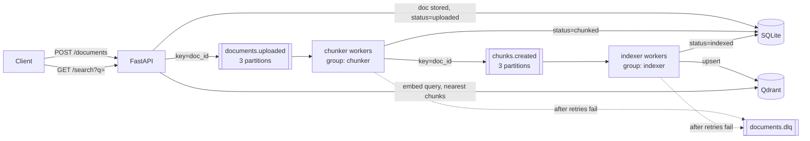

# Real-time document ingestion (RAG) with FastAPI + Kafka

Upload a document and it is chunked, embedded and indexed asynchronously through Kafka,
then searchable through a vector database. Built to learn the parts of Kafka that matter
in real systems: partitions and keys, consumer groups, manual offset commits, retries and
a dead-letter topic.

## Architecture



| Piece | Role |
|---|---|
| `app/api.py` | Upload endpoints, document status, search |
| `app/chunker_worker.py` | `documents.uploaded` → overlapping chunks → `chunks.created` |
| `app/indexer_worker.py` | `chunks.created` → embedding → Qdrant, tracks progress |
| `app/kafka_utils.py` | Shared consumer loop: manual commits, retries with backoff, DLQ |
| `app/db.py` | SQLite document/progress state (shared volume) |

## Kafka concepts it demonstrates

- **Keys and partitions:** messages are keyed by `doc_id`, so everything for one document stays on one partition, in order.
- **Consumer groups:** `chunker` and `indexer` are separate groups. Scale either one and Kafka splits the 3 partitions between the copies.
- **At-least-once delivery:** offsets are committed only after a message is processed.
- **Idempotent processing:** because messages can be delivered twice, Qdrant point ids are deterministic (`uuid5(doc_id:chunk_index)`) and SQLite progress rows are `INSERT OR IGNORE`. Reprocessing never creates duplicates.
- **Retries and dead letters:** each message is tried 3 times with exponential backoff, then sent to `documents.dlq` and the document is marked `failed` with the reason.

## Run it

Needs Docker.

```bash
docker compose up -d --build
```

This starts Kafka (KRaft, no Zookeeper), creates the three topics with 3 partitions each, Qdrant, Kafka UI, the API, and one chunker and one indexer.

| URL | What |
|---|---|
| http://localhost:8000/docs | Swagger UI for the API |
| http://localhost:8080 | Kafka UI: topics, partitions, messages, consumer groups |
| http://localhost:6333/dashboard | Qdrant dashboard |

## Try it

```bash
./demo.sh        # uploads sample_docs/, waits for indexing, runs two searches
```

Or by hand:

```bash
curl -X POST http://localhost:8000/documents -F "file=@sample_docs/kafka-basics.md"
curl http://localhost:8000/documents                       # status: uploaded -> chunked -> indexed
curl "http://localhost:8000/search?q=how do consumer groups share partitions"
```

## Things to try (these are the interesting parts)

**See consumer groups split partitions**

```bash
docker compose up -d --scale chunker=3 --scale indexer=3
```

Open Kafka UI → Consumers → `chunker` / `indexer` and watch each copy take one partition.
Stop one container (`docker stop <name>`) and watch the partitions rebalance.

**See the dead-letter topic**

Upload a file with no words in it:

```bash
printf -- '-----' > /tmp/empty.txt
curl -X POST http://localhost:8000/documents -F "file=@/tmp/empty.txt"
curl "http://localhost:8000/documents?status=failed"      # error: chunker: document has no indexable text
```

After 3 attempts the message appears in the `documents.dlq` topic (Kafka UI → Topics).

**See idempotency**

Reset the `chunker` group's offsets to the beginning in Kafka UI (stop the chunker first), start it again, and check that `GET /stats` and the Qdrant point count do not change.

## Tests

```bash
python -m venv .venv && source .venv/bin/activate
pip install -r requirements-dev.txt
pytest
```

The tests run the whole pipeline logic without Kafka or Docker: a fake producer captures
messages and they are fed into the next stage, with Qdrant in in-memory mode. They cover chunking,
SQLite progress tracking, idempotent redelivery, validation errors, Kafka being down, and the retry wrapper.

## Embeddings

The default embedder is a hashed bag-of-words: deterministic and needs no model download, so
the project runs offline, but it only matches on shared words, not meaning. For real semantic
search, install `fastembed` and start with `EMBEDDER=fastembed`:

```bash
pip install fastembed          # add it to requirements.txt for the Docker image
EMBEDDER=fastembed docker compose up -d --build
```

The first start downloads the `BAAI/bge-small-en-v1.5` model. If you switch embedders on an
existing setup, delete the Qdrant volume (`docker compose down -v`) because the vector size changes.

## Configuration

| Env var | Default | Meaning |
|---|---|---|
| `KAFKA_BOOTSTRAP` | `localhost:9092` | Broker address (compose sets `kafka:19092`) |
| `QDRANT_URL` | `http://localhost:6333` | Qdrant address |
| `SQLITE_PATH` | `rag.db` | SQLite file (compose uses `./data/rag.db`) |
| `EMBEDDER` | `hash` | `hash` or `fastembed` |
| `CHUNK_SIZE` / `CHUNK_OVERLAP` | `800` / `100` | Characters per chunk / overlap |
| `MAX_ATTEMPTS` / `RETRY_BACKOFF` | `3` / `1.0` | Tries per message / first backoff in seconds |
| `MAX_UPLOAD_BYTES` | `500000` | Upload limit (Kafka's default message limit is about 1 MB) |

## Limitations

- Text files only (`.txt`, `.md`). PDF extraction would be a good next step.
- Search returns the closest chunks; it does not call an LLM to write an answer yet.
- SQLite is shared by the API and workers through a volume, which is fine for a demo; use Postgres for anything real.
- Single Kafka broker, replication factor 1.
